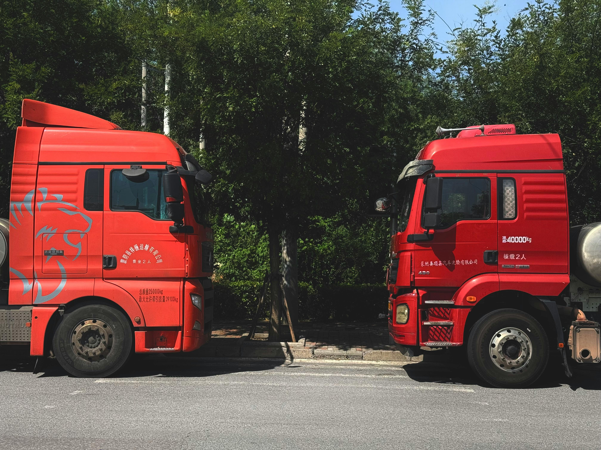

# 🚛 Loadify — Truck Dispatching Website

<p align="center">


</p>

<p align="center">
A modern, responsive truck dispatching website built to help owner-operators and trucking companies find profitable loads, streamline operations and grow faster.
</p>

---

## 🌐 Live Demo

<p align="center">

[](https://your-live-link.com)
[](https://github.com/yourusername/loadify)

</p>

> Replace the links above with your GitHub repository and deployed website URL.

---

## 📸 Preview

<p align="center">


</p>

---

## ✨ Overview

**Loadify** is a premium static business website designed for a truck dispatching company. It provides a strong online presence for dispatch services while helping drivers and fleet owners connect with high-paying freight loads.

The project focuses on:

* Clean professional branding
* Responsive mobile-first layout
* Lead generation through forms
* Clear service presentation
* Smooth user experience
* Trust-building testimonials and FAQs

---

## 🚀 Core Features

### 📱 Responsive Design

Fully optimized for:

* Desktop
* Tablet
* Mobile devices

### ⚡ Interactive Components

* Mobile navigation toggle
* FAQ accordion system
* About section “Learn More” toggle
* Driver registration form validation
* Contact form UI interactions

### 📄 Business Pages

* Home Page
* Services Page
* Pricing Page
* Driver Registration
* Contact Page

### 💼 Dispatching Focused Content

* 24/7 Dispatch Support
* Route Optimization
* Rate Negotiation
* Paperwork Handling
* Driver Assistance
* Load Booking Support

---

## 🛠 Tech Stack

| Technology        | Usage             |
| ----------------- | ----------------- |
| HTML5             | Structure         |
| CSS3              | Styling           |
| JavaScript        | Interactivity     |
| Flexbox / Grid    | Responsive Layout |
| Google Maps Embed | Location Section  |

---

## 📁 Project Structure

```text
Truck Dispatching/
├─ .vscode/
│  └─ settings.json
├─ assets/
│  ├─ icons/
│  ├─ images/
│  │  ├─ Truck1.jpg
│  │  └─ Truck2.jpg
│  └─ logo/
├─ javascript/
│  ├─ about.js
│  ├─ driver.js
│  └─ faq.js
├─ style/
│  ├─ about.css
│  ├─ contact.css
│  ├─ content.css
│  ├─ driver.css
│  ├─ faq.css
│  ├─ footer.css
│  ├─ getStart.css
│  ├─ nav.css
│  ├─ parallax.css
│  ├─ pricing.css
│  ├─ services.css
│  ├─ servicesOwn.css
│  └─ testmonials.css
├─ contact.html
├─ driver.html
├─ index.html
├─ pricing.html
├─ README.md
└─ services.html
```

---

## ⚙️ Local Setup

### 1️⃣ Clone Repository

```bash
git clone https://github.com/yourusername/loadify.git
cd loadify
```

### 2️⃣ Run Locally

Open directly:

```bash
start index.html
```

Or run a local server:

```bash
python -m http.server 8000
```

Then open:

```text
http://localhost:8000
```

---

## 🌍 Deployment Options

You can deploy instantly on:

* GitHub Pages
* Netlify
* Vercel

<p align="center">

[](https://netlify.com)

[](https://vercel.com)

</p>

---

## ✅ Quality Check

* All internal links verified
* Buttons working correctly
* Forms validated
* CSS & JS linked properly
* Mobile responsive tested
* Image paths confirmed

---

## 📬 Contact

**Loadify Dispatching Services**

📧 [info@loadify.com](mailto:info@loadify.com)
📞 +92 (123) 456-7890

---

## 👨‍💻 Author

Developed with passion for logistics, trucking and modern web experiences.

---

## ⭐ Support

If you like this project:

* Star the repository
* Fork it
* Share it
* Improve it

---

<p align="center">
<b>Built with ❤️ for Pakistani Truckers</b>
</p>
